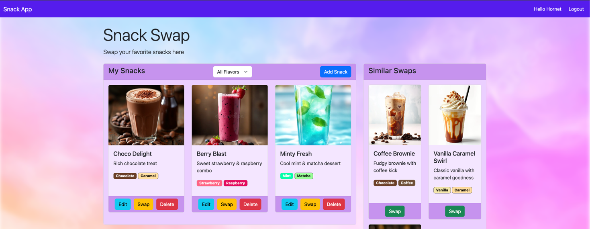

# 🍫 Snack Swap

Snack Swap is a Rails application for sharing and swapping your favorite snacks and their flavors. 
It’s built with **Ruby on Rails 8**, **Bootstrap 5**, and **Turbo/Hotwire**.

---



## ✨ Features

- 👤 **User Authentication**
    - Lightweight authentication system using Rails’ built-in `has_secure_password`
    - Users must be logged in to view or manage snacks

- 🍭 **Snack Management**
    - Create, edit, and delete snacks
    - Each snack can have multiple flavors
    - Snacks are displayed as interactive Bootstrap cards
    - Flavors are displayed as colored Bootstrap badges

- 🎨 **Flavor Filtering**
    - Filter snacks by flavor from a dropdown selector
    - Flavor tags are color-coded for visual clarity

- 🔄 **Snack Swapping**
    - Suggests similar or complementary snacks based on shared flavors
    - uses Swap buttons for quick swapping in and out

- 💡 **Snack of the Day**
    - Highlights the most Popular Snack

- ⚡ **Turbo Modal UI**
    - Add/Edit/Delete snacks through modals
    - All functions happen on virtually the same page

---
## Setup Instructions

1. **Clone the repository**
```bash
git clone https://github.com/jonahcancio/snack_swap.git
cd snack_swap
```

2. **Install dependencies**

```bash
bundle install
```

3. **Set up the database**

```bash
rails db:create
rails db:migrate
rails db:seed
```

4. **Start the Rails server**
```bash
rails server
```
5. **Visit the application**

6. Open your browser and go to [http://localhost:3000](http://localhost:3000)

### Additional Notes
**Seed Data**: The seeded database includes two default users:

  | Name  | Email              | Password   |
    |-------|------------------|-----------|
  | Admin | admin@admin.com   | admin123  |
  | Hornet| hornet@silksong.com | shaw      |

```
user1 = User.create!(
  name: "Admin",
  email: "admin@admin.com",
  password: "admin123"
)

user2 = User.create!(
  name: "Hornet",
  email: "hornet@silksong.com",
  password: "shaw"
)
```
**Login Instructions**:  
  To log in as the Admin user, use:
  - **Email:** `admin@admin.com`
  - **Password:** `admin123`


* To login with admin enter `admin@admin.com` into email and `admin123` in password

---

## 🧩 Models and Relationships

```ruby
# app/models/user.rb
class User < ApplicationRecord
  has_secure_password
  has_many :user_snacks, dependent: :destroy
  has_many :snacks, through: :user_snacks
  
  def similar_snacks
  def complementary_snacks
end

# app/models/snack.rb
class Snack < ApplicationRecord
  has_many :user_snacks, dependent: :destroy
  has_many :users, through: :user_snacks

  has_many :snack_flavors, dependent: :destroy
  has_many :flavors, through: :snack_flavors

  def self.most_popular

end

# app/models/flavor.rb
class Flavor < ApplicationRecord
  has_many :snack_flavors, dependent: :destroy
  has_many :snacks, through: :snack_flavors
  
  def self.similar_color?(hex1, hex2, tolerance: 0.1)

  def self.complementary_color?(hex1, hex2, tolerance: 0.1)

end
```

## 🧪 Testing

Snack Swap uses **RSpec**, **FactoryBot**, and **Capybara** for its testing framework.  
All main features and associations are tested, including:

- `User#similar_snacks`
- `User#complementary_snacks`
- `Snack.most_popular`
- All CRUD requests for **Snacks**

---

### ⚙️ Running Tests

To run model specs:

```bash
bundle exec rspec spec/models
```

To run request specs:

```bash
bundle exec rspec spec/requests
```


